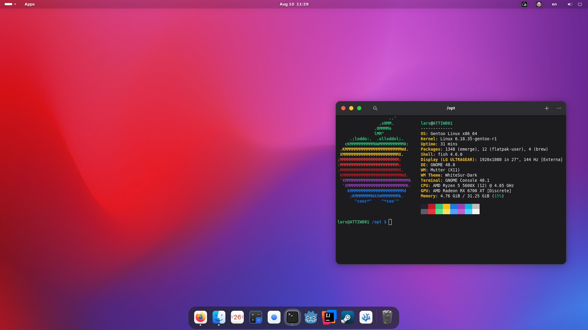

PC Dotfiles
============

These are my PC's dotfiles<br>
The contents of this repository are licensed under the MIT license. For details see the LICENSE file.
This rice is supposed to mirror the appearance of MacOS.

## Previous Rice Versions
Niri based everforest sharp edged rice: until commit 2d5a81fdde52a95236fce131fe9c8c57e9d9aacd

## Screenshot

This wallpaper is from the GNOME default wallpapers.<br>
  Copyright © 2023 David Lapshin <ddaudix@gmail.com> <br>
  Licensed under Creative Commons Attribution-ShareAlike 3.0 License.<br>

More can be found in the `img/` directory.

## License
This repo is licensed under the MIT license, except for the files in `img/` which are licensed under CC-BY-SA 3.0. See `img/LICENSE` for details

## Color theme
This rice uses the ayu dark color theme

## Programs
- DE: Gnome
- Files: Nautilus
- Editor: Nvim (included) + VSCodium (not included)
- Fetch: fastfetch
- Process manager: htop


## Installation
WARNING: Following these instructions may overwrite or delete your existing configuration files. 
You assume full responsibility for any data loss, system damage, or other issues. 
Always back up important files before proceeding.

To use my dotfiles, do the following:
- Back up your existing ~/.config folder, for example using 
```bash
mv ~/.config ~/.config.bak
```
- Prepare the empty .config folder using 
```bash
mkdir ~/.config
```
- Clone this repository into ~/.config<br>
```bash
git clone https://github.com/LarsLerchbacher/dotfiles-pc ~/.config
```
- Copy over all required configurations, that do not conflict with the ones from this repo, from ~/.config.bak into ~/.config
- Install GNOME
- Install the WhiteSur GTK and Icon Theme
- Install traffic-light-buttons-gtk
- Download some Mac OS wallpapers and set one in the GNOME config
- Reboot

And you're good to go!

