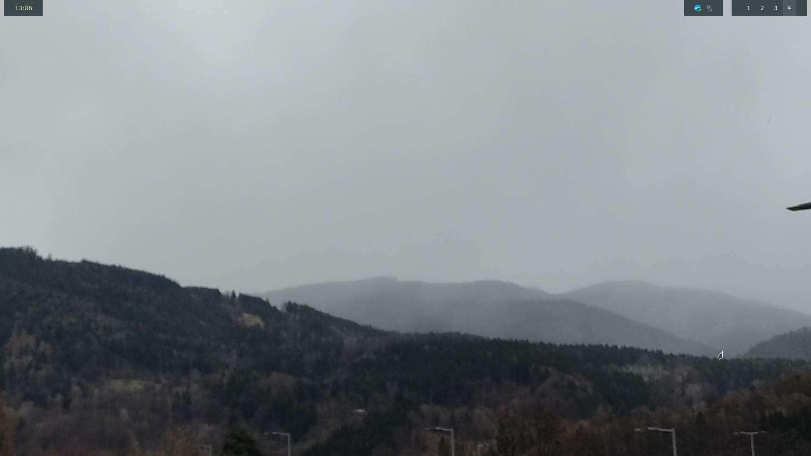

PC Dotfiles
============

These are my PC's dotfiles<br>
Currently, I am reworking my system and will be doing a new rice afterwards.<br>
I'm pretty inexperienced in ricing, so it's nothing special.<br>
The contents of this repository are licensed under the MIT license. For details see the LICENSE file.

## Screenshot


More can be found in the `img/` directory.

## Color theme
This rice uses the everforest color theme

## Programs
- WM: niri
- Bar: waybar
- Editor: Nvim (included) + VSCodium (not included)
- Notifications: swaync
- Widgets: Eww
- Launcher/Menu: wofi
- Fetch: fastfetch
- Process manager: htop


## Installation
WARNING: Following these instructions may overwrite or delete your existing configuration files. 
You assume full responsibility for any data loss, system damage, or other issues. 
Always back up important files before proceeding.

To use my dotfiles, do the following:
- Back up your existing ~/.config folder, for example using 
```bash
mv ~/.config ~/.config.bak
```
- Prepare the empty .config folder using 
```bash
mkdir ~/.config
```
- Clone this repository into ~/.config<br>
```bash
git clone https://github.com/LarsLerchbacher/dotfiles-pc ~/.config
```
- Copy over all required configurations, that do not conflict with the ones from this repo, from ~/.config.bak into ~/.config
- Install the required programs
- Download the Everforest GTK Theme from [it's GitHub repo](https://github.com/Fausto-Korpsvart/Everforest-GTK-Theme) and put the folder of the version you want into /usr/share/themes
- Reboot

And you're good to go!

